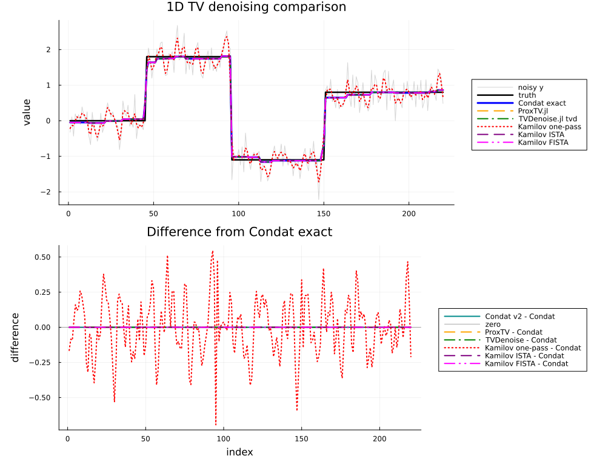

```@meta
EditURL = "../../lit/examples/1d_examples.jl"
```

# 1D TV Denoising

This example compares the current 1D methods:

- Condat v1 direct solver;
- Condat v2 direct solver;
- ProxTV.jl reference solver;
- TVDenoise.jl sparse ADMM solver;
- weighted Kamilov one-pass shrinkage;
- weighted Kamilov ISTA and FISTA diagnostics.

The Kamilov one-pass method is included as an experiment. It currently does
not match Condat exactly. Kamilov's equations (18a)-(18b) are shown here as
ISTA, and FISTA applies the standard accelerated momentum to the same proximal step.

````julia
using BenchmarkTools
using LinearAlgebra
using Plots
using ProxTV
using Random
using TVDenoise
using TVDenoising


````

## Helper functions

````julia
function proxtv_1d(y, λ)
    h = NormTVp(λ, 1.0, length(y))
    x = similar(y, Float64)
    prox!(x, h, y, 1.0)
    return x
end

rmse(x, xtrue) = norm(x - xtrue) / sqrt(length(x))
tv1_value(x) = sum(abs.(diff(x)));
````

## Build a piecewise-constant test signal

````julia
Random.seed!(2026)

N = 220
xtrue = vcat(
    fill(0.0, 45),
    fill(1.8, 50),
    fill(-1.1, 55),
    fill(0.8, 70),
)
y = xtrue + 0.35 * randn(N)
λ = 1.0;
````

## Run methods

````julia
x_condat_v1 = similar(y)
x_condat_v2 = similar(y)
x_kamilov = similar(y)
a = similar(y)
d = similar(y)
γ_ista = 0.0000317
γ_fista = 0.00001

tv1d_condat_v1!(x_condat_v1, y, λ)
tv1d_condat_v2!(x_condat_v2, y, λ)
tv1d_kamilov_onepass!(x_kamilov, y, λ, a, d)
x_ista = tv1d_kamilov_ista(y, λ; γ=γ_ista, maxiter=200000)
x_fista = tv1d_kamilov_fista(y, λ; γ=γ_fista, maxiter=20000)
x_proxtv = proxtv_1d(y, λ)
ρ_tvd = 5.0
x_tvd, hist_tvd = tvd(y, λ, ρ_tvd; maxit=10000, tol=1e-8, verbose=false)

results = [
    ("Condat v2", norm(x_condat_v2 - x_condat_v1, Inf), rmse(x_condat_v2, xtrue), tv1_value(x_condat_v2)),
    ("ProxTV", norm(x_proxtv - x_condat_v1, Inf), rmse(x_proxtv, xtrue), tv1_value(x_proxtv)),
    ("TVDenoise.jl tvd", norm(x_tvd - x_condat_v1, Inf), rmse(x_tvd, xtrue), tv1_value(x_tvd)),
    ("Kamilov one-pass", norm(x_kamilov - x_condat_v1, Inf), rmse(x_kamilov, xtrue), tv1_value(x_kamilov)),
    ("Kamilov ISTA", norm(x_ista - x_condat_v1, Inf), rmse(x_ista, xtrue), tv1_value(x_ista)),
    ("Kamilov FISTA", norm(x_fista - x_condat_v1, Inf), rmse(x_fista, xtrue), tv1_value(x_fista)),
]

for (name, err, r, tv) in results
    println(rpad(name, 18), "  ||x-Condat||∞ = ", err, "  RMSE = ", r, "  TV = ", tv)
end
println("TVDenoise.jl tvd iterations = ", hist_tvd.k, ", ρ = ", ρ_tvd)
println("Kamilov ISTA γ = ", γ_ista, ", maxiter = 200000")
println("Kamilov FISTA γ = ", γ_fista, ", maxiter = 20000")
````

````
Condat v2           ||x-Condat||∞ = 1.1102230246251565e-15  RMSE = 0.08069495087595199  TV = 7.049041747477734
ProxTV              ||x-Condat||∞ = 2.220446049250313e-16  RMSE = 0.08069495087595191  TV = 7.049041747477727
TVDenoise.jl tvd    ||x-Condat||∞ = 1.056153499989776e-6  RMSE = 0.08069500965990475  TV = 7.04904353673056
Kamilov one-pass    ||x-Condat||∞ = 0.6936854570208262  RMSE = 0.23522949968725393  TV = 36.24946024789661
Kamilov ISTA        ||x-Condat||∞ = 0.000673866843181381  RMSE = 0.08073997970659562  TV = 7.058916043299575
Kamilov FISTA       ||x-Condat||∞ = 0.0006534998034120054  RMSE = 0.08066004208082816  TV = 7.050092352437126
TVDenoise.jl tvd iterations = 191, ρ = 5.0
Kamilov ISTA γ = 3.17e-5, maxiter = 200000
Kamilov FISTA γ = 1.0e-5, maxiter = 20000

````

## ISTA/FISTA implementation benchmark

This benchmark uses a fixed iteration count and preallocated workspace. It
measures implementation cost only; FISTA can need fewer iterations for a
comparable error level.

````julia
bench_iters = 10_000
bench_γ = 1.0e-5

x_ista_b = similar(y)
a_ista_b = similar(y)
d_ista_b = similar(y)
z_ista_b = similar(y)
xprev_ista_b = similar(y)

x_fista_b = similar(y)
a_fista_b = similar(y)
d_fista_b = similar(y)
z_fista_b = similar(y)
xprev_fista_b = similar(y)
q_fista_b = similar(y)
qprev_fista_b = similar(y)

bench_ista = @benchmark tv1d_kamilov_ista!(
    $x_ista_b, $y, $λ, $a_ista_b, $d_ista_b, $z_ista_b, $xprev_ista_b;
    γ=$bench_γ, maxiter=$bench_iters,
) seconds=0.2 samples=20 evals=1
bench_fista = @benchmark tv1d_kamilov_fista!(
    $x_fista_b, $y, $λ, $a_fista_b, $d_fista_b, $z_fista_b, $xprev_fista_b,
    $q_fista_b, $qprev_fista_b;
    γ=$bench_γ, maxiter=$bench_iters,
) seconds=0.2 samples=20 evals=1

for (name, b) in (("ISTA", bench_ista), ("FISTA", bench_fista))
    t_ms = median(b).time / 1e6
    mem = median(b).memory
    allocs = median(b).allocs
    println(rpad(name, 8), "  median time = ", round(t_ms; digits=3),
            " ms, memory = ", mem, " bytes, allocations = ", allocs)
end
````

````
ISTA      median time = 3.008 ms, memory = 0 bytes, allocations = 0
FISTA     median time = 3.691 ms, memory = 0 bytes, allocations = 0

````

## Plot the comparison

````julia
p_signal = plot(
    y;
    label="noisy y",
    color=:gray70,
    alpha=0.55,
    linewidth=1,
    title="1D TV denoising comparison",
    ylabel="value",
    legend=:outerright,
)
plot!(p_signal, xtrue; label="truth", color=:black, linewidth=2.5)
plot!(p_signal, x_condat_v1; label="Condat exact", color=:blue, linewidth=3)
plot!(p_signal, x_proxtv; label="ProxTV.jl", color=:orange, linewidth=2, linestyle=:dash)
plot!(p_signal, x_tvd; label="TVDenoise.jl tvd", color=:green, linewidth=2, linestyle=:dashdot)
plot!(p_signal, x_kamilov; label="Kamilov one-pass", color=:red, linewidth=2, linestyle=:dot)
plot!(p_signal, x_ista; label="Kamilov ISTA", color=:purple, linewidth=2, linestyle=:dash)
plot!(p_signal, x_fista; label="Kamilov FISTA", color=:magenta, linewidth=2, linestyle=:dashdotdot)

p_error = plot(
    x_condat_v2 .- x_condat_v1;
    label="Condat v2 - Condat",
    color=:cyan4,
    linewidth=2,
    title="Difference from Condat exact",
    xlabel="index",
    ylabel="difference",
    legend=:outerright,
)
hline!(p_error, [0.0]; label="zero", color=:black, linewidth=1, alpha=0.35)
plot!(p_error, x_proxtv .- x_condat_v1; label="ProxTV - Condat", color=:orange, linewidth=2, linestyle=:dash)
plot!(p_error, x_tvd .- x_condat_v1; label="TVDenoise - Condat", color=:green, linewidth=2, linestyle=:dashdot)
plot!(p_error, x_kamilov .- x_condat_v1; label="Kamilov one-pass - Condat", color=:red, linewidth=2, linestyle=:dot)
plot!(p_error, x_ista .- x_condat_v1; label="Kamilov ISTA - Condat", color=:purple, linewidth=2, linestyle=:dash)
plot!(p_error, x_fista .- x_condat_v1; label="Kamilov FISTA - Condat", color=:magenta, linewidth=2, linestyle=:dashdotdot)

p = plot(p_signal, p_error; layout=(2, 1), size=(980, 760), left_margin=6Plots.mm);

````



