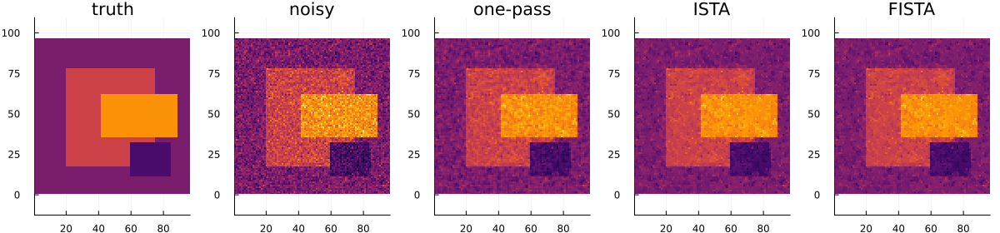

```@meta
EditURL = "../../lit/examples/2d_examples.jl"
```

# 2D Kamilov Denoising

This example runs the current one-pass 2D Kamilov transform-shrink-synthesis
denoiser on a synthetic image.

The method is useful as a compact transform-domain TV experiment. It is not
presented here as an exact 2D TV solver.

````julia
using LinearAlgebra
using Plots
using Random

repo = dirname(dirname(dirname(@__DIR__)));

include(joinpath(repo, "src", "2D_denoising.jl"))

asset_dir = joinpath(repo, "docs", "src", "assets");
mkpath(asset_dir);
````

## Synthetic image

````julia
Random.seed!(2026)

M, N = 96, 96
xtrue = zeros(Float64, M, N)
xtrue[18:78, 20:74] .= 0.7
xtrue[36:62, 42:88] .= 1.4
xtrue[12:32, 60:84] .= -0.4

y = xtrue + 0.25 * randn(M, N)
λ = 0.08
````

````
0.08
````

## Run the in-place 2D method

````julia
x = similar(y)
av = similar(y)
dv = similar(y)
ah = similar(y)
dh = similar(y)

tv2d_kamilov_denoise!(x, y, λ, av, dv, ah, dh)

rmse(x, xtrue) = norm(x - xtrue) / sqrt(length(x))

println("Noisy RMSE   = ", rmse(y, xtrue))
println("Kamilov RMSE = ", rmse(x, xtrue))
````

````
Noisy RMSE   = 0.24872577727892217
Kamilov RMSE = 0.15442213621634499

````

## Plot the result

````julia
clims = extrema(vcat(vec(xtrue), vec(y), vec(x)))

p1 = heatmap(xtrue; title="truth", aspect_ratio=:equal, colorbar=false, clims=clims)
p2 = heatmap(y; title="noisy", aspect_ratio=:equal, colorbar=false, clims=clims)
p3 = heatmap(x; title="Kamilov one-pass", aspect_ratio=:equal, colorbar=false, clims=clims)
p = plot(p1, p2, p3; layout=(1, 3), size=(900, 300))

savefig(p, joinpath(asset_dir, "lit_2d_kamilov.png"));
````



